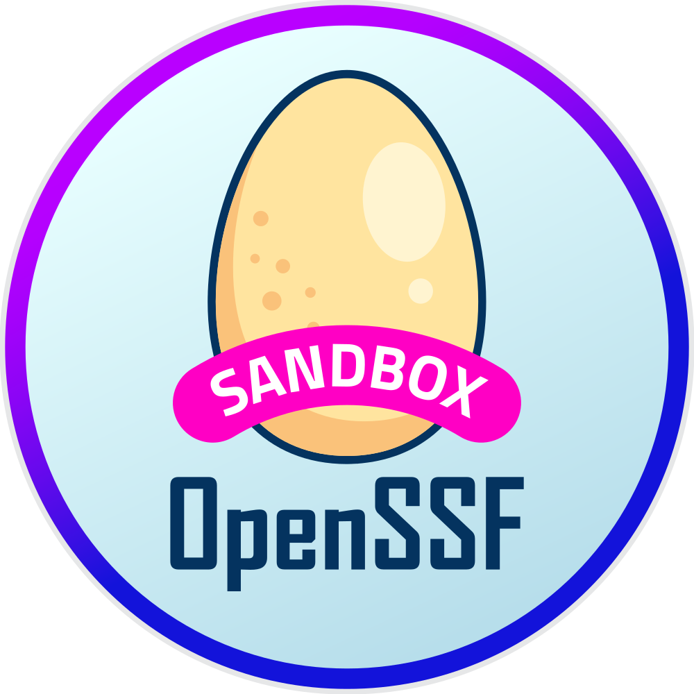

<center></center>
<center></center>

[](https://securityscorecards.dev/viewer/?uri=github.com/bomctl/bomctl)
[](https://goreportcard.com/report/github.com/bomctl/bomctl)
[](https://pkg.go.dev/github.com/bomctl/bomctl)
[](https://slack.openssf.org/#bomctl)

__bomctl__ is format-agnostic Software Bill of Materials (SBOM) tooling, which is intended to bridge the gap between SBOM generation and SBOM analysis tools. It focuses on supporting more complex SBOM operations on multiple SBOM files that represent systems by being opinionated on only supporting the [NTIA minimum fields](https://www.ntia.doc.gov/files/ntia/publications/sbom_minimum_elements_report.pdf) or other fields supported by [protobom](https://github.com/protobom/protobom).

- [Try `bomctl` in our gitpod playground](https://gitpod.io/?autostart=true#https://github.com/bomctl/bomctl-playground)

> [!NOTE]
> This is an experimental project under active development. We'd love feedback on the concept, scope, and architecture!

## Features

- Work with multiple SBOMs in tree structures (through external references)
- Fetch and push SBOMs using multiple protocols
- Leverage a `.netrc` file to handle authentication
- Manage SBOMs using a persistent database cache
- __FUTURE__ - Manipulate SBOMs with commands like `diff`, `split`, and `redact`
- __FUTURE__ - Interface with OpenSSF projects and services like [GUAC](https://guac.sh/) and [Sigstore](https://www.sigstore.dev/)

## Join our Community

- [#bomctl on OpenSSF Slack](https://openssf.slack.com/archives/C06ED5VB81W)
- [OpenSSF Security Tooling Working Group Meeting](https://zoom-lfx.platform.linuxfoundation.org/meeting/94897563315?password=7f03d8e7-7bc9-454e-95bd-6e1e09cb3b0b) - Every two weeks on Friday, 8am Pacific
- [SBOM Tooling Working Meeting](https://zoom-lfx.platform.linuxfoundation.org/meeting/92103679564?password=c351279a-5cec-44a4-ab5b-e4342da0e43f) - Every Monday, 2pm Pacific

## Installation

### Homebrew

```shell
brew tap bomctl/bomctl && brew install bomctl
```

### Container Images

Container images for bomctl can be found on [Docker Hub](https://hub.docker.com/r/bomctl/bomctl).

``` shell
docker run bomctl/bomctl:latest --help
```

### Install From Source

Installing bomctl requires the following:

- [Go](https://go.dev/dl/)
- [Git](https://git-scm.com/downloads)
- [Make](https://www.gnu.org/software/make/manual/make.html)

Clone the bomctl repository

``` shell
git clone https://github.com/bomctl/bomctl.git
cd bomctl
```

Build using the `Makefile`

| Operating System | Architecture | `make` Command           |
| ---------------- | ------------ | ------------------------ |
| Linux            | AMD64        | `make build-linux-amd`   |
| Linux            | ARM          | `make build-linux-arm`   |
| Windows          | AMD64        | `make build-windows-amd` |
| Windows          | ARM          | `make build-windows-arm` |
| MacOS            | AMD64        | `make build-macos-intel` |
| MacOS            | ARM          | `make build-macos-apple` |

## Commands

`bomctl` stores SBOMs in a cache database, this allows more complex cross SBOM document operations to exist. This is a fundemental concept; files are not directly modified, the cache is.

`bomctl` uses the [protobom library](https://github.com/protobom/protobom) to store the SBOM component graph in a SBOM format agnostic manner. When you interact with the `bomctl` cache, you are interacting with the [protobom library](https://github.com/protobom/protobom).

- SBOMs are read into the cache
  - [fetch](#fetch)
  - [import](#import)
- SBOMs are operated on the cache
  - [list](#list)
- SBOMs are outputted out of the cache
  - [export](#export)

### Export

Export stored SBOM(s) to stdout or the filesystem.

```shell
bomctl export [flags] SBOM_ID...

Flags:
  -e, --encoding string    output encoding [spdx: [json], cyclonedx: [json, xml]] (default "json")
  -f, --format string      output format [spdx, spdx-2.3, cyclonedx, cyclonedx-1.0, cyclonedx-1.1, cyclonedx-1.2, cyclonedx-1.3, cyclonedx-1.4, cyclonedx-1.5] (default "cyclonedx")
  -h, --help               help for export
  -o, --output-file FILE   path to output file
```

### Fetch

Ability to retrieve an SBOM files from HTTP(S), OCI, or Git URLs:

```shell
bomctl fetch [flags] SBOM_URL...

Flags:
  -h, --help               help for fetch
      --netrc              Use .netrc file for authentication to remote hosts
  -o, --output-file FILE   Path to output file
```

This includes recursive loading of external references in an SBOM to other SBOMs and placing them into the persistent cache. If SBOMs are access controlled, a user's [.netrc](https://www.gnu.org/software/inetutils/manual/html_node/The-_002enetrc-file.html) file to authenticate.

The following example will fetch this [CycloneDX SBOM](https://raw.githubusercontent.com/bomctl/bomctl-playground/main/examples/bomctl-container-image/bomctl_bomctl_v0.3.0.cdx.json)
that represents a container image and will then recursively fetch an externally referenced SBOM that
represents an application within the container image.

```shell
bomctl fetch https://raw.githubusercontent.com/bomctl/bomctl-playground/main/examples/bomctl-container-image/bomctl_bomctl_v0.3.0.cdx.json
```

### Import

Import SBOM file(s) from stdin or local filesystem.

```shell
bomctl import [flags] { - | FILE...}

Flags:
  -h, --help   help for import
```

### List

List SBOM documents in local cache.

```shell
bomctl list [flags] SBOM_ID...

Aliases:
  list, ls

Flags:
  -h, --help   help for list
```

## Roadmap

The project is focused on building an architecture that enables reading in, operating on, and reading
out collections of SBOM files independent of format. Creating an architecture that allows the relationships
between components in a SBOM document, and then relationships between SBOM documents in the priority.

Once that is established, more complex operations will be implemented. This operations include:

- `Diff`
  - Generating diffs between components and component dependencies
  - Generating diffs of component properties
  - Creating diffs in machine readable and human readable formats
- `Enrich`
  - Use the [Transparency Exchange API](https://github.com/CycloneDX/transparency-exchange-api) to find enrich sbom components with additional data.
  - Interface with [GUAC](https://guac.sh/)
- `Merge`
  - Merge fields from similar components in two or more SBOM documents
  - Merge components and component dependencies from two or more SBOM documents
  - Flatten multiple SBOM document component dependencies into a single SBOM document
- `Redact`
  - Redact fields by regular express or field name while keeping tracibility to the original document
- `Split`
  - Split an SBOM dependency tree into multiple files based on purl type or component identifier
- `Trim`
  - Trim an SBOM dependency tree based on purl type or component identifier
- __Your suggestions too!__

## Similar Projects

- [Kubernetes bom](https://github.com/kubernetes-sigs/bom) is a utility that lets you create, view and transform Software Bills of Materials (SBOMs). bom was created as part of the project to create an SBOM for the Kubernetes project. It enables software authors to generate an SBOM for their projects in a simple, yet powerful way.
- [CycloneDX sbom-utility](https://github.com/CycloneDX/sbom-utility) was designed to be an API platform to validate, analyze and edit Bills-of-Materials (BOMs). Initially, it was created to validate either CycloneDX or SPDX-formatted BOMs against official, versioned JSON schemas as published by their respective standards communities.
- [sbommerge](https://github.com/anthonyharrison/sbommerge) merges two Software Bill of Materials (SBOMs) documents together. It supports SBOMs created in both SPDX and CycloneDX formats.

## Verifying Integrity

### Verifying Container Images

Container images for `bomctl` can be found [here](https://hub.docker.com/r/bomctl/bomctl) and are signed
using keyless signing with cosign.

You can then verify this container image with cosign.

``` shell
cosign verify --certificate-oidc-issuer https://token.actions.githubusercontent.com --certificate-identity-regexp 'https://github\.com/bomctl/bomctl/\.github/.+'  bomctl/bomctl:latest
```

### Verifying Releases

`bomctl` releases can be found [here](https://github.com/bomctl/bomctl/releases) and are signed
using keyless signing with cosign.

You can then verify this artifact with cosign.

``` shell
cosign verify-blob --certificate ${artifact}-keyless.pem --signature ${artifact}-keyless.sig --certificate-oidc-issuer https://token.actions.githubusercontent.com --certificate-identity-regexp 'https://github\.com/bomctl/bomctl/\.github/.+'  ${artifact}
```

If the result is `Verified OK`, the verification is successful.

You can also look up the entry in the public Rekor instance using a sha256 hash.

``` shell
shasum -a 256 bomctl_SNAPSHOT-3f16bdb_checksums.txt |awk '{print $1}'
```

The printed `hash` can be used to look up the entry at <https://search.sigstore.dev/>.

> Copyright © bomctl a Series of LF Projects, LLC
> For web site terms of use, trademark policy and other project policies
> please see <https://lfprojects.org>.
