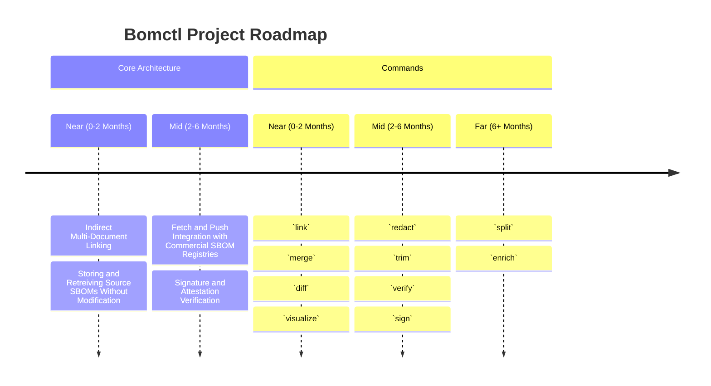

# Roadmap

The project is focused on building an architecture that enables reading in, operating on, and reading
out collections of SBOM files independent of format. This project requires an architecture that
prioritizes the relationships between components in a SBOM document and between SBOM documents.

## Missing Architecture

### Indirect Multi-Document Linking (2 Months)

`bomctl` can recursively retrieve SBOMs based on URIs, there needs to be architecture decisions and
implementation on how to "indirectly" link SBOMs that are in the cache. For example how do we link
SBOMs based on purl, serial number, or name/verson.

Key questions that need answers are:

- Should linking automatically happen when SBOMs are added to the cache?
- When SBOMs are `push`ed to an external location, should all the external references be updated
to allow easy `fetch`ing by someone else?

### Storing and Retreiving Source SBOMs Without Modification (2 Months)

Some users of `bomctl` will need SBOMs ingested into the cache outputted without modification.

Reasons would be:

- Ability to verify signatures of SBOMs that are moved from one system to the next with `bomctl`
- SBOMs with data not supported by protobom can be preserved if the SBOM is not modified

The biggest architectural decision is how should be maintain tracibility from a component to the
SBOM it originally came from.

### `fetch` and `push` Integration with Commercial SBOM Registries (3 Months)

One of the big usecases for `bomctl` is the ability to fetch and push SBOMs from different SBOM
registries. Many will be COTS or SaaS services and we'll need to simplify interactions 
with these.

For example, If SBOMs have external references that are serial numbers, can we search a SaaS
SBOM registry to recursively fetch SBOMs (instead of using URLs).

### Signature and Attestation Verification (2 Months)

Teams will be signing and attesting to SBOMs how should this be tied into `bomctl`?

## Commands

### Document and Document Relationship Commands (1 Month)

- `link`
  - Ability to create external references between documents
- `merge`
  - Merge fields from similar components in two or more SBOM documents
  - Merge components and component dependencies from two or more SBOM documents
  - Flatten multiple SBOM document component dependencies into a single SBOM document
- `split`
  - Split an SBOM dependency tree into multiple files based on purl type or component identifier

### SBOM Graph Manipulation Commands (4 Months)

- `enrich`
  - Use the [Transparency Exchange API](https://github.com/CycloneDX/transparency-exchange-api) to find enrich sbom components with additional data.
  - Interface with [GUAC](https://guac.sh/)
- `redact`
  - Redact fields by regular expressions or field name while keeping tracibility to the original document
- `trim`
  - Trim an SBOM dependency tree based on purl type or component identifier

## Signing and Attestations Commands (2 Months)

- `verify`
  - Ability to verify SBOM document signatures using Sigstore
- `sign`
  - Ability to sign SBOM documents using Sigstore

### Visualization Commands (3 Months)

- `diff`
  - Generating diffs between components and component dependencies
  - Generating diffs of component properties
  - Creating diffs in machine readable and human readable formats
- `visualize`
  - CLI or server based visualize of the document and component relationship
